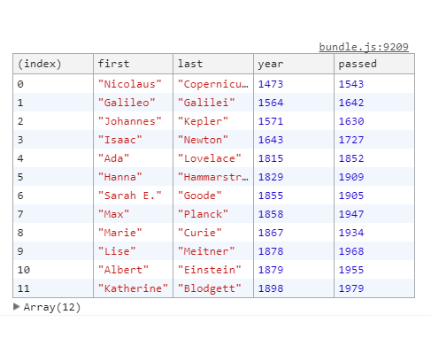
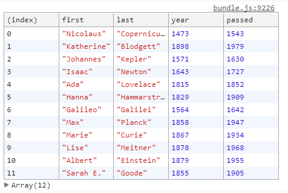
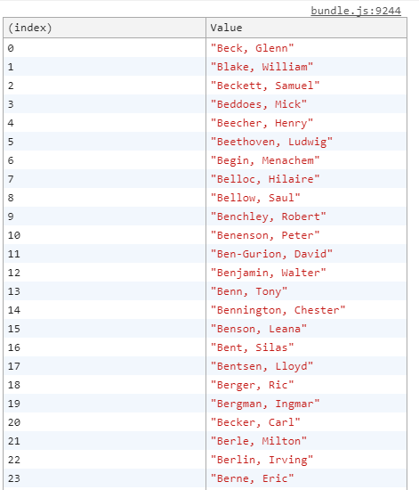
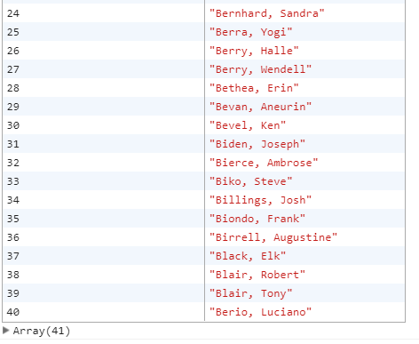

here we go

# JS-Challenge-Day-4 ( Array Cardio Day 1) including myAnswers
  
  

      const inventors = [
        { first: 'Albert', last: 'Einstein', year: 1879, passed: 1955 },
        { first: 'Isaac', last: 'Newton', year: 1643, passed: 1727 },
        { first: 'Galileo', last: 'Galilei', year: 1564, passed: 1642 },
        { first: 'Marie', last: 'Curie', year: 1867, passed: 1934 },
        { first: 'Johannes', last: 'Kepler', year: 1571, passed: 1630 },
        { first: 'Nicolaus', last: 'Copernicus', year: 1473, passed: 1543 },
        { first: 'Max', last: 'Planck', year: 1858, passed: 1947 },
        { first: 'Katherine', last: 'Blodgett', year: 1898, passed: 1979 },
        { first: 'Ada', last: 'Lovelace', year: 1815, passed: 1852 },
        { first: 'Sarah E.', last: 'Goode', year: 1855, passed: 1905 },
        { first: 'Lise', last: 'Meitner', year: 1878, passed: 1968 },
        { first: 'Hanna', last: 'Hammarström', year: 1829, passed: 1909 }
      ];
  
      const people = ['Beck, Glenn', 'Becker, Carl', 'Beckett, Samuel', 'Beddoes, 
      Mick', 'Beecher, Henry', 'Beethoven, Ludwig', 'Begin, Menachem', 'Belloc, 
      Hilaire', 'Bellow, Saul', 'Benchley, Robert', 'Benenson, Peter', 'Ben-Gurion, 
      David', 'Benjamin, Walter', 'Benn, Tony', 'Bennington, Chester', 'Benson, 
      Leana', 'Bent, Silas', 'Bentsen, Lloyd', 'Berger, Ric', 'Bergman, Ingmar', 
      'Berio, Luciano', 'Berle, Milton', 'Berlin, Irving', 'Berne, Eric', 'Bernhard, Sandra', 
      'Berra, Yogi', 'Berry, Halle', 'Berry, Wendell', 'Bethea, Erin', 'Bevan, Aneurin', 
      'Bevel, Ken', 'Biden, Joseph', 'Bierce, Ambrose', 'Biko, Steve', 'Billings, Josh', 
      'Biondo, Frank', 'Birrell, Augustine', 'Black, Elk', 'Blair, Robert', 'Blair, Tony', 
      'Blake, William'];
 
 
 
 
 
 # Array.prototype.filter()
 1. Filter the list of inventors for those who were born in the 1500's
  
  
        const oldies = inventors.filter(inventor => (inventor.year >= 1500 && inventor.year < 1600))
        console.table(oldies);
      
    

  # Array.prototype.map()
  2. Give us an array of the inventors' first and last names
 
         const fullNames = inventors.map(inventor => `${inventor.first} ${inventor.last}`);
         console.log(fullNames);

     
    
  # Array.prototype.sort()
  3. Sort the inventors by birthdate, oldest to youngest
  
          const birthday = inventors.sort((a,b) => a.year > b.year ? 1: -1);
          console.table(birthday);
          
      
    
  # Array.prototype.reduce()
  4. How many years did all the inventors live?

            const totalYears = inventors.reduce((total, inventor) => {
              return total + (inventor.passed - inventor.year);
            }, 0);
            console.log(totalYears);
  
      //861

  # Array.prototype.sort()
  5. Sort the inventors by years lived
  
    const oldest = inventors.sort((a,b) => {
    const lastGuy = a.passed - a.year;
    const nextGuy = b.passed - b.year;
    lastGuy > nextGuy ? -1: 1;
      });

      console.table(oldest);

   
    
  # map() filter()
  6. (https://en.wikipedia.org/wiki/Category:Boulevards_in_Paris)
  Create a list of Boulevards in Paris that contain 'de' anywhere in the name
  For this exercise work on the console of the webpage provided.
 
 
     const category = document.querySelector('.mw-category');
      const links = [...category.querySelectorAll('a')];
      const de = links
                  .map(link => link.textContent)
                  .filter(streetName => streetName.includes('de') );

 
   
    
  # Array.prototype.sort()
  7. Sort Exercise
  Sort the people alphabetically by last name

            const inOrder = people.sort((a,b) => {return a-b});
            console.table(inOrder);

  
   
  
    
    
  # Array.prototype.reduce()
  8. Sum up the instances of each of these
  
          const data = ['car', 'car', 'truck', 'truck', 'bike', 'walk', 'car', 'van', 
          'bike', 'walk', 'car', 'van', 'car', 'truck' ];
          
    const count = data.reduce((x,y) => {
          x[y] = (x[y] + 1) || 1;
            return x
    }, {} );
    console.table(count);

   

 
